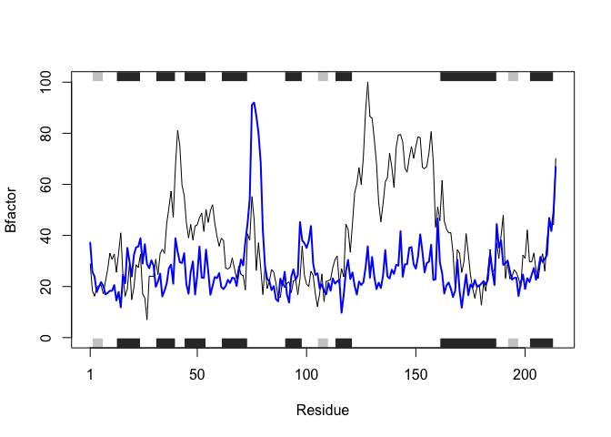

Class 6 R Functions
================
Barry Grant
10/18/2019

# This is a H1

This is my class 6 work. THis will be **bold**

## A H2

### A level 3 headding H3

``` r
plot(1:10)
```

<!-- -->

Read files again…

``` r
read.table("test1.txt", sep=",", header=TRUE)
```

    ##   Col1 Col2 Col3
    ## 1    1    2    3
    ## 2    4    5    6
    ## 3    7    8    9
    ## 4    a    b    c

``` r
read.csv("test1.txt")
```

    ##   Col1 Col2 Col3
    ## 1    1    2    3
    ## 2    4    5    6
    ## 3    7    8    9
    ## 4    a    b    c

``` r
read.table("test2.txt", sep="$", header=T)
```

    ##   Col1 Col2 Col3
    ## 1    1    2    3
    ## 2    4    5    6
    ## 3    7    8    9
    ## 4    a    b    c

``` r
read.table("test3.txt")
```

    ##   V1 V2 V3
    ## 1  1  6  a
    ## 2  2  7  b
    ## 3  3  8  c
    ## 4  4  9  d
    ## 5  5 10  e

Our first silly function

``` r
add <- function(x, y=1) {  
    # Sum the input x and y
    x + y
}
```

``` r
add( x=c(5, 6, 1, 5, 10), y=100 )
```

    ## [1] 105 106 101 105 110

``` r
add( c(5, 5, NA, 7) )
```

    ## [1]  6  6 NA  8

``` r
x <- range( c(5,2,7,10) )
x[1] # min value
```

    ## [1] 2

``` r
x[2] # max value
```

    ## [1] 10

A second funcrtion

``` r
rescale <- function(x) {
   rng <-range(x)
   (x - rng[1]) / (rng[2] - rng[1])
}
```

``` r
rescale( c(1, 2, NA, 5) )
```

    ## [1] NA NA NA NA

``` r
x <- c(1, 2, NA, 5) 
range(x, na.rm=TRUE)
```

    ## [1] 1 5

``` r
rescale2 <- function(x) {
   rng <-range(x, na.rm=TRUE)
   (x - rng[1]) / (rng[2] - rng[1])
}
```

``` r
rescale2( c(1, 2, NA, 5) )
```

    ## [1] 0.00 0.25   NA 1.00

``` r
rescale3 <- function(x, na.rm=TRUE, plot=FALSE) {

    rng <-range(x, na.rm=na.rm)
    print("Hello")

   answer <- (x - rng[1]) / (rng[2] - rng[1])
   return(answer)
   
   print("is it me you are looking for?")

   if(plot) { 
      plot(answer, typ="b", lwd=4) 
   }
   print("I can see it in ...")
   return(answer)
}
```

``` r
rescale3(1:10, plot=TRUE)
```

    ## [1] "Hello"

    ##  [1] 0.0000000 0.1111111 0.2222222 0.3333333 0.4444444 0.5555556 0.6666667
    ##  [8] 0.7777778 0.8888889 1.0000000

Install the bio3d package with

``` r
#install.packages("bio3d")
```

``` r
library(bio3d)
```

``` r
x <- read.pdb("4ake")
```

    ##   Note: Accessing on-line PDB file

``` r
is.list(x)
```

    ## [1] TRUE

``` r
x
```

    ## 
    ##  Call:  read.pdb(file = "4ake")
    ## 
    ##    Total Models#: 1
    ##      Total Atoms#: 3459,  XYZs#: 10377  Chains#: 2  (values: A B)
    ## 
    ##      Protein Atoms#: 3312  (residues/Calpha atoms#: 428)
    ##      Nucleic acid Atoms#: 0  (residues/phosphate atoms#: 0)
    ## 
    ##      Non-protein/nucleic Atoms#: 147  (residues: 147)
    ##      Non-protein/nucleic resid values: [ HOH (147) ]
    ## 
    ##    Protein sequence:
    ##       MRIILLGAPGAGKGTQAQFIMEKYGIPQISTGDMLRAAVKSGSELGKQAKDIMDAGKLVT
    ##       DELVIALVKERIAQEDCRNGFLLDGFPRTIPQADAMKEAGINVDYVLEFDVPDELIVDRI
    ##       VGRRVHAPSGRVYHVKFNPPKVEGKDDVTGEELTTRKDDQEETVRKRLVEYHQMTAPLIG
    ##       YYSKEAEAGNTKYAKVDGTKPVAEVRADLEKILGMRIILLGAPGA...<cut>...KILG
    ## 
    ## + attr: atom, xyz, seqres, helix, sheet,
    ##         calpha, remark, call

``` r
# Can you improve this analysis code?
library(bio3d)
s1 <- read.pdb("4AKE")  # kinase with drug
```

    ##   Note: Accessing on-line PDB file

    ## Warning in get.pdb(file, path = tempdir(), verbose = FALSE): /var/folders/
    ## xf/qznxnpf91vb1wm4xwgnbt0xr0000gn/T//Rtmp2s8fX3/4AKE.pdb exists. Skipping
    ## download

``` r
s2 <- read.pdb("1AKE")  # kinase no drug
```

    ##   Note: Accessing on-line PDB file
    ##    PDB has ALT records, taking A only, rm.alt=TRUE

``` r
s3 <- read.pdb("1E4Y")  # kinase with drug
```

    ##   Note: Accessing on-line PDB file

``` r
s1.chainA <- trim.pdb(s1, chain="A", elety="CA")
s2.chainA <- trim.pdb(s2, chain="A", elety="CA")
s3.chainA <- trim.pdb(s3, chain="A", elety="CA")

s1.b <- s1.chainA$atom$b
s2.b <- s2.chainA$atom$b
s3.b <- s3.chainA$atom$b

plotb3(s1.b, sse=s1.chainA, typ="l", ylab="Bfactor")
```

<!-- -->

``` r
plotb3(s2.b, sse=s2.chainA, typ="l", ylab="Bfactor")
```

<!-- -->

``` r
plotb3(s3.b, sse=s3.chainA, typ="l", ylab="Bfactor")
```

<!-- -->

``` r
plotb3(s1.b, sse=s1.chainA, typ="l", ylab="Bfactor")
points(s2.b, type="l", col="blue", lwd=2)
```

<!-- -->
